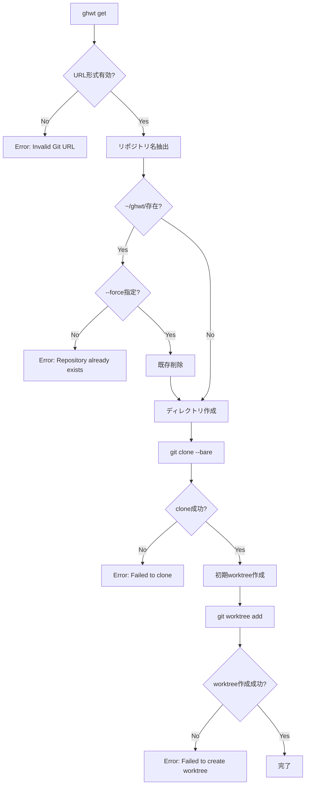
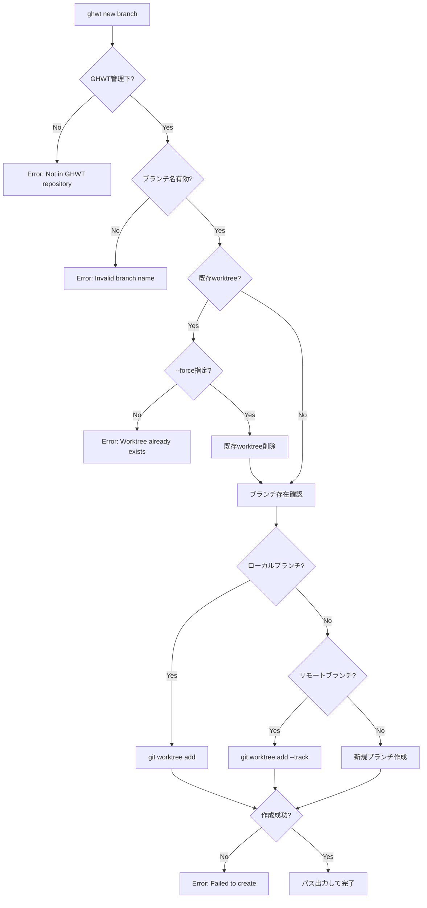

# GHWT CLI インターフェース完全仕様書

**Version**: 1.0  
**Date**: 2025-06-01  
Version 1.0 — 2025-06-01

## このドキュメントの役割

- **対象読者**: 開発者、実装担当者、CLI利用者
- **目的**: GHWT CLIコマンドの完全なインターフェース仕様を定義
- **含む内容**: 全コマンドの構文、引数、オプション、入出力形式、エラーパターン
- **他ドキュメントとの関係**: CLI実装の根拠となる仕様（実装時の参照ドキュメント）

## 概要

本ドキュメントは GHWT (Git Worktree Tool) のCLIインターフェースの完全仕様書である。
MVP版として実装される `ghwt get` と `ghwt new` コマンドの詳細な入出力仕様、
エラーハンドリング、JSON出力形式を定義し、一貫性のあるCLI体験を確保する。
MVPとして必要最小限のコマンド（`ghwt get`、`ghwt new`）の入出力仕様を機械可読形式で定義し、複数AIの並行開発における基盤インターフェースとして機能する。

## 関連ドキュメント

- [../002-requirements/requirements-ja.md](../002-requirements/requirements-ja.md) - 基本要件
- [../004-adr/](../004-adr/) - アーキテクチャ決定記録

## 変更履歴

| 日付 | バージョン | 変更内容 |
|------|------------|----------|
| 2025-06-01 | 1.0 | MVP版作成（get/newコマンドのみ） |

---

## 1. コマンド一覧と基本構文

### 1.1 基本コマンド（MVP）

```bash
ghwt get <url> [options]                    # リポジトリ取得・変換
ghwt new <branch> [options]                 # Worktree 作成
```

### 1.2 グローバルオプション

| オプション | 短縮形 | 説明 | デフォルト |
|-----------|--------|------|-----------|
| `--help` | `-h` | ヘルプ表示 | - |
| `--version` | `-V` | バージョン表示 | - |
| `--verbose` | `-v` | 詳細出力 | false |
| `--quiet` | `-q` | 静寂モード | false |
| `--json` | - | JSON形式出力 | false |

---

## 2. 各コマンドの詳細仕様

### 2.1 `ghwt get` - リポジトリ取得・変換

#### 構文
```bash
ghwt get <url> [options]
```

#### 引数
| 引数 | 型 | 必須 | 説明 | 制約 |
|------|----|----|------|------|
| `<url>` | string | ✓ | Git リポジトリ URL | 有効な Git URL 形式 |

#### オプション
| オプション | 短縮形 | 型 | デフォルト | 説明 |
|-----------|--------|----|---------|----|
| `--branch` | `-b` | string | `main` | 初期ブランチ指定 |
| `--force` | `-f` | boolean | false | 既存ディレクトリの上書き |

#### 処理フロー



#### 標準出力
**成功時:**
```
Repository cloned successfully: ~/ghwt/myrepo
Initial worktree created: ~/ghwt/myrepo/.wt/main
```

**JSON形式 (`--json`):**
```json
{
  "status": "success",
  "repository": {
    "name": "myrepo",
    "url": "git@github.com:user/myrepo.git",
    "path": "~/ghwt/myrepo",
    "bare_path": "~/ghwt/myrepo/.bare"
  },
  "initial_worktree": {
    "branch": "main",
    "path": "~/ghwt/myrepo/.wt/main"
  }
}
```

#### 標準エラー出力
```
Error: Repository already exists at ~/ghwt/myrepo (use --force to overwrite)
Error: Invalid Git URL: <url>
Error: Failed to clone repository: <git_error_message>
```

#### 終了コード
**詳細なエラーコード体系**: [../003-designs/error-handling.md](../003-designs/error-handling.md)

| コード | 説明 |
|--------|------|
| 0 | 成功 |
| 1 | 一般的なエラー |
| 2 | Git関連エラー |
| 3 | ネットワークエラー |
| 4 | ファイルシステムエラー |

### 2.2 `ghwt new` - Worktree 作成

#### 構文
```bash
ghwt new <branch> [options]
```

#### 引数
| 引数 | 型 | 必須 | 説明 | 制約 |
|------|----|----|------|------|
| `<branch>` | string | ✓ | ブランチ名 | 有効なGitブランチ名 |

#### オプション
| オプション | 短縮形 | 型 | デフォルト | 説明 |
|-----------|--------|----|---------|----|
| `--track` | `-t` | string | - | 追跡するリモートブランチ |
| `--force` | `-f` | boolean | false | 既存 worktree の上書き |

#### 処理フロー



#### 標準出力
**重要: 最終行に作成されたパスを出力**
```
Creating worktree for branch 'feature-auth'...
Worktree created successfully
~/ghwt/myrepo/.wt/feature-auth
```

**JSON形式 (`--json`):**
```json
{
  "status": "success",
  "worktree": {
    "repository": "myrepo",
    "branch": "feature-auth",
    "path": "~/ghwt/myrepo/.wt/feature-auth",
    "tracking": "origin/feature-auth",
    "created_at": "2025-06-01T12:34:56Z"
  }
}
```

#### 標準エラー出力
```
Error: Repository not found (run from GHWT repository or specify <repo>)
Error: Invalid branch name: <branch>
Error: Worktree already exists: ~/ghwt/myrepo/.wt/feature-auth
Error: Failed to create worktree: <git_error_message>
```

#### 終了コード
**詳細なエラーコード体系**: [../003-designs/error-handling.md](../003-designs/error-handling.md)

| コード | 説明 |
|--------|------|
| 0 | 成功 |
| 1 | 一般的なエラー |
| 2 | Git関連エラー |
| 3 | ネットワークエラー |
| 4 | ファイルシステムエラー |

---

## 3. JSON出力スキーマ

### 3.1 共通スキーマ

#### BaseResponse
```json
{
  "$schema": "http://json-schema.org/draft-07/schema#",
  "type": "object",
  "properties": {
    "status": {
      "type": "string",
      "enum": ["success", "error"]
    },
    "timestamp": {
      "type": "string",
      "format": "date-time"
    },
    "version": {
      "type": "string"
    }
  },
  "required": ["status"]
}
```

#### ErrorResponse
```json
{
  "allOf": [
    {"$ref": "#/definitions/BaseResponse"}
  ],
  "properties": {
    "status": {"const": "error"},
    "error": {
      "type": "object",
      "properties": {
        "code": {"type": "integer"},
        "message": {"type": "string"},
        "details": {"type": "string"}
      },
      "required": ["code", "message"]
    }
  }
}
```

### 3.2 Repository スキーマ
```json
{
  "type": "object",
  "properties": {
    "name": {"type": "string"},
    "url": {"type": "string", "format": "uri"},
    "path": {"type": "string"},
    "bare_path": {"type": "string"}
  },
  "required": ["name", "path"]
}
```

### 3.3 Worktree スキーマ
```json
{
  "type": "object",
  "properties": {
    "repository": {"type": "string"},
    "branch": {"type": "string"},
    "path": {"type": "string"},
    "created_at": {"type": "string", "format": "date-time"},
    "tracking": {"type": "string"}
  },
  "required": ["repository", "branch", "path"]
}
```

---

## 4. 使用例

### 4.1 基本的なワークフロー

```bash
# 1. リポジトリを取得
ghwt get git@github.com:myorg/myapp.git

# 2. 新機能用のブランチを作成
cd "$(ghwt new myapp feature-auth)"

# 3. 別のブランチでも作業
cd "$(ghwt new myapp hotfix-123)"
```

### 4.2 複数リポジトリでの作業

```bash
# 複数のリポジトリを取得
ghwt get git@github.com:myorg/frontend.git
ghwt get git@github.com:myorg/backend.git

# 同じ機能を複数リポジトリで開発
cd "$(ghwt new frontend feature-payment)"
cd "$(ghwt new backend feature-payment)"
```

### 4.3 JSON出力を活用したスクリプト

```bash
# リポジトリ情報をJSONで取得
ghwt get git@github.com:user/repo.git --json | jq '.repository.path'

# Worktree作成結果をJSONで取得
ghwt new myapp feature-test --json | jq '.worktree.path'
```

---

## 5. エラーハンドリング

### 5.1 エラー処理方針

GHWT は統一されたエラーハンドリング戦略を採用します。

**完全なエラー仕様**: [../003-designs/error-handling.md](../003-designs/error-handling.md)

### 5.2 基本エラーフォーマット

```
Error: <簡潔な説明>
Details: <詳細情報>
Suggestion: <解決方法の提案>
```

### 5.3 主要エラーパターン

| エラータイプ | 対応 | 例 |
|-------------|------|-----|
| 引数エラー | ヘルプ表示・修正提案 | `Error: Invalid URL format` |
| リソースエラー | 状態確認・代替案提示 | `Error: Repository already exists` |
| Git操作エラー | Git状態診断・修復提案 | `Error: Failed to create worktree` |

---

## 完了条件チェックリスト

- [x] MVPに必要な2つのコマンド（get/new）が定義されている
- [x] 各コマンドの入出力仕様が明確に定義されている
- [x] JSON出力スキーマが含まれている
- [x] エラーハンドリングが定義されている
- [x] 使用例が含まれている
- [x] 機械可読形式で記述されている

---

*本仕様書は GHWT プロジェクトのMVP版CLI インターフェースの基盤仕様として、複数AIの並行開発を支援します。* 