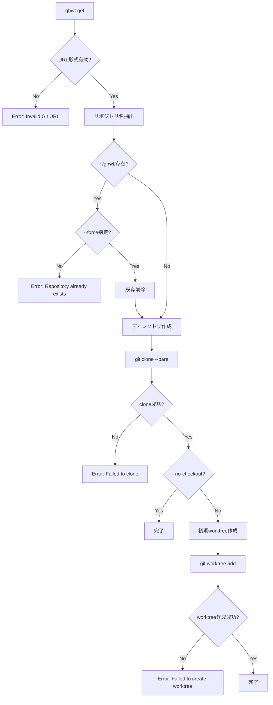
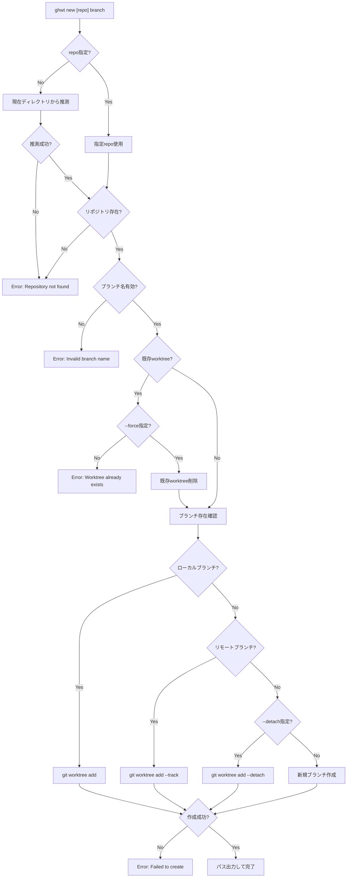
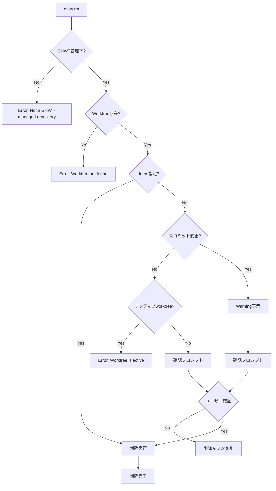
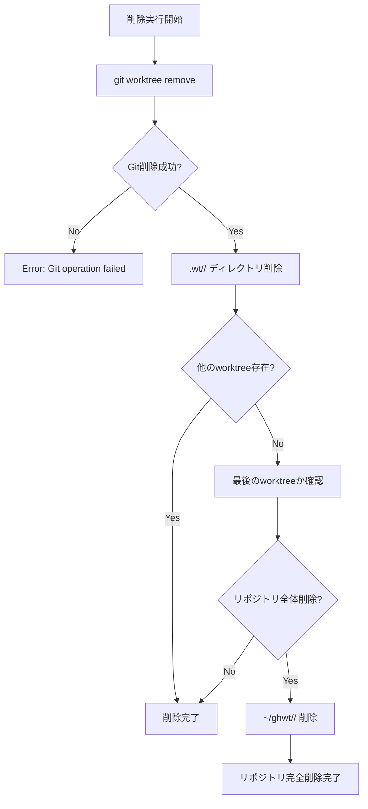
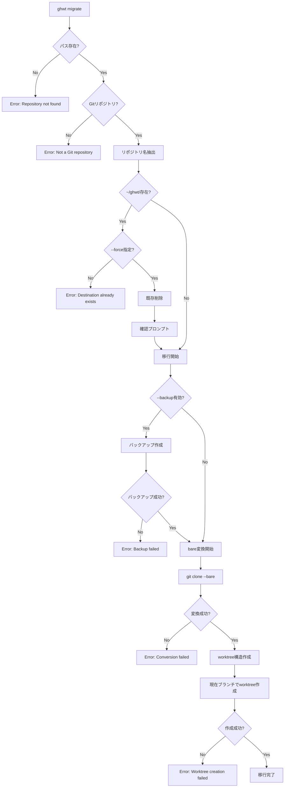

# GHWT CLI インターフェース完全仕様書

Version 1.0 — 2025-05-31

## 概要

本ドキュメントは GHWT (Git Worktree Tool) の CLI インターフェース完全仕様書である。
全コマンドの入出力仕様を機械可読形式で定義し、複数AIの並行開発における基盤インターフェースとして機能する。

## 関連ドキュメント

- [../002-requirements/requirements-ja.md](../002-requirements/requirements-ja.md) - 基本要件
- [../001-adr/](../001-adr/) - アーキテクチャ決定記録

## 変更履歴

| 日付 | バージョン | 変更内容 |
|------|------------|----------|
| 2025-05-31 | 1.0 | 初版作成 |

---

## 1. コマンド一覧と基本構文

### 1.1 基本コマンド

```bash
ghwt get <url> [options]                    # リポジトリ取得・変換
ghwt new [<repo>] <branch> [options]        # Worktree 作成
ghwt ls [options]                           # Worktree 一覧表示
ghwt rm <repo> <branch> [options]           # Worktree 削除
ghwt prune [options]                        # 古い Worktree のクリーンアップ
ghwt config <subcommand> [args]             # 設定管理
ghwt migrate <path> [options]               # 既存リポジトリの変換
```

### 1.2 補助コマンド

```bash
ghwt-newcd [<repo>] <branch> [options]      # Worktree 作成 + ディレクトリ移動
ghwt fzf [options]                          # fzf による対話的選択
```

### 1.3 グローバルオプション

| オプション | 短縮形 | 説明 | デフォルト |
|-----------|--------|------|-----------|
| `--help` | `-h` | ヘルプ表示 | - |
| `--version` | `-V` | バージョン表示 | - |
| `--verbose` | `-v` | 詳細出力 | false |
| `--quiet` | `-q` | 静寂モード | false |
| `--json` | - | JSON形式出力 | false |
| `--config` | `-c` | 設定ファイルパス指定 | `~/.config/ghwt/config.toml` |

---

## 2. 各コマンドの詳細仕様

### 2.1 `ghwt get` - リポジトリ取得・変換

#### 構文
```bash
ghwt get <url> [options]
```

#### 引数
| 引数 | 型 | 必須 | 説明 | 制約 |
|------|----|----|------|------|
| `<url>` | string | ✓ | Git リポジトリ URL | 有効な Git URL 形式 |

#### オプション
| オプション | 短縮形 | 型 | デフォルト | 説明 |
|-----------|--------|----|---------|----|
| `--branch` | `-b` | string | `main` | 初期ブランチ指定 |
| `--depth` | `-d` | integer | - | shallow clone の深度 |
| `--force` | `-f` | boolean | false | 既存ディレクトリの上書き |
| `--no-checkout` | - | boolean | false | 初期チェックアウトをスキップ |

#### 処理フロー



#### 標準出力
**成功時:**
```
Repository cloned successfully: ~/ghwt/myrepo
Initial worktree created: ~/ghwt/myrepo/.wt/main
```

**JSON形式 (`--json`):**
```json
{
  "status": "success",
  "repository": {
    "name": "myrepo",
    "url": "git@github.com:user/myrepo.git",
    "path": "~/ghwt/myrepo",
    "bare_path": "~/ghwt/myrepo/.bare"
  },
  "initial_worktree": {
    "branch": "main",
    "path": "~/ghwt/myrepo/.wt/main"
  }
}
```

#### 標準エラー出力
```
Error: Repository already exists at ~/ghwt/myrepo (use --force to overwrite)
Error: Invalid Git URL: <url>
Error: Failed to clone repository: <git_error_message>
```

#### 終了コード
| コード | 説明 |
|--------|------|
| 0 | 成功 |
| 1 | 一般的なエラー |
| 2 | 無効な引数 |
| 3 | リポジトリが既に存在 |
| 4 | Git操作エラー |

### 2.2 `ghwt new` - Worktree 作成

#### 構文
```bash
ghwt new [<repo>] <branch> [options]
```

#### 引数
| 引数 | 型 | 必須 | 説明 | 制約 |
|------|----|----|------|------|
| `<repo>` | string | - | リポジトリ名 | 省略時は現在のディレクトリから推測 |
| `<branch>` | string | ✓ | ブランチ名 | 有効なGitブランチ名 |

#### オプション
| オプション | 短縮形 | 型 | デフォルト | 説明 |
|-----------|--------|----|---------|----|
| `--track` | `-t` | string | - | 追跡するリモートブランチ |
| `--force` | `-f` | boolean | false | 既存 worktree の上書き |
| `--detach` | - | boolean | false | detached HEAD で作成 |

#### 処理フロー



#### 標準出力
**重要: 最終行に作成されたパスを出力**
```
Creating worktree for branch 'feature-auth'...
Worktree created successfully
~/ghwt/myrepo/.wt/feature-auth
```

**JSON形式 (`--json`):**
```json
{
  "status": "success",
  "worktree": {
    "repository": "myrepo",
    "branch": "feature-auth",
    "path": "~/ghwt/myrepo/.wt/feature-auth",
    "tracking": "origin/feature-auth",
    "created_at": "2025-05-31T12:34:56Z"
  }
}
```

#### 標準エラー出力
```
Error: Repository 'myrepo' not found
Error: Branch 'feature-auth' already has a worktree at ~/ghwt/myrepo/.wt/feature-auth
Error: Failed to create worktree: <git_error_message>
```

#### 終了コード
| コード | 説明 |
|--------|------|
| 0 | 成功 |
| 1 | 一般的なエラー |
| 2 | 無効な引数 |
| 3 | リポジトリが見つからない |
| 4 | ブランチが既に存在 |
| 5 | Git操作エラー |

### 2.3 `ghwt ls` - Worktree 一覧表示

#### 構文
```bash
ghwt ls [options]
```

#### オプション
| オプション | 短縮形 | 型 | デフォルト | 説明 |
|-----------|--------|----|---------|----|
| `--all` | `-a` | boolean | false | 全リポジトリの worktree を表示 |
| `--repo` | `-r` | string | - | 特定リポジトリのみ表示 |
| `--format` | `-f` | string | `table` | 出力形式 (table/list/json) |
| `--sort` | `-s` | string | `name` | ソート順 (name/age/repo) |

#### 標準出力
**テーブル形式 (デフォルト):**
```
REPOSITORY  BRANCH        PATH                           AGE
myrepo      main          ~/ghwt/myrepo/.wt/main         2d
myrepo      feature-auth  ~/ghwt/myrepo/.wt/feature-auth 1h
backend     develop       ~/ghwt/backend/.wt/develop     5d
```

**JSON形式 (`--json`):**
```json
{
  "worktrees": [
    {
      "repository": "myrepo",
      "branch": "main",
      "path": "~/ghwt/myrepo/.wt/main",
      "created_at": "2025-05-29T10:00:00Z",
      "last_modified": "2025-05-31T09:30:00Z",
      "age_days": 2,
      "tracking": "origin/main",
      "status": "clean"
    },
    {
      "repository": "myrepo",
      "branch": "feature-auth",
      "path": "~/ghwt/myrepo/.wt/feature-auth",
      "created_at": "2025-05-31T11:00:00Z",
      "last_modified": "2025-05-31T12:00:00Z",
      "age_days": 0,
      "tracking": "origin/feature-auth",
      "status": "dirty"
    }
  ],
  "summary": {
    "total_worktrees": 2,
    "total_repositories": 1
  }
}
```

#### 終了コード
| コード | 説明 |
|--------|------|
| 0 | 成功 |
| 1 | 一般的なエラー |
| 2 | 無効な引数 |

### 2.4 `ghwt rm` - Worktree 削除

#### 構文
```bash
ghwt rm <repo> <branch> [options]
```

#### 引数
| 引数 | 型 | 必須 | 説明 | 制約 |
|------|----|----|------|------|
| `<repo>` | string | ✓ | リポジトリ名 | 存在するリポジトリ |
| `<branch>` | string | ✓ | ブランチ名 | 存在するブランチ |

#### オプション
| オプション | 短縮形 | 型 | デフォルト | 説明 |
|-----------|--------|----|---------|----|
| `--force` | `-f` | boolean | false | 未保存変更があっても削除 |
| `--dry-run` | `-n` | boolean | false | 削除対象の表示のみ |

#### 削除前の安全性チェックフロー



**確認プロンプトの例:**
```
Warning: Worktree has uncommitted changes:
  M  src/main.rs
  ?? new_file.txt

This will permanently delete the worktree and all uncommitted changes.
Continue? [y/N]: 
```

#### 削除実行プロセス



#### 標準出力
```
Removing worktree: ~/ghwt/myrepo/.wt/feature-auth
Worktree removed successfully
```

**JSON形式 (`--json`):**
```json
{
  "status": "success",
  "removed_worktree": {
    "repository": "myrepo",
    "branch": "feature-auth",
    "path": "~/ghwt/myrepo/.wt/feature-auth"
  }
}
```

#### 標準エラー出力
```
Error: Worktree has uncommitted changes (use --force to remove anyway)
Error: Worktree not found: ~/ghwt/myrepo/.wt/feature-auth
Error: Not a GHWT-managed repository
```

#### 終了コード
| コード | 説明 |
|--------|------|
| 0 | 成功 |
| 1 | 一般的なエラー |
| 2 | 無効な引数 |
| 3 | Worktree が見つからない |
| 4 | 未保存変更あり |
| 5 | GHWT管理下ではない |

### 2.5 `ghwt prune` - 古い Worktree のクリーンアップ

#### 構文
```bash
ghwt prune [options]
```

#### オプション
| オプション | 短縮形 | 型 | デフォルト | 説明 |
|-----------|--------|----|---------|----|
| `--expire` | `-e` | string | `30d` | 期限 (例: 7d, 2w, 1m) |
| `--dry-run` | `-n` | boolean | false | 削除対象の表示のみ |
| `--force` | `-f` | boolean | false | 確認なしで削除 |
| `--repo` | `-r` | string | - | 特定リポジトリのみ |

#### 標準出力
```
Found 3 worktrees older than 30 days:
  ~/ghwt/myrepo/.wt/old-feature (45 days)
  ~/ghwt/backend/.wt/experiment (60 days)
  ~/ghwt/frontend/.wt/prototype (90 days)

Remove these worktrees? [y/N]: y
Removed 3 worktrees
```

**JSON形式 (`--json`):**
```json
{
  "status": "success",
  "pruned_worktrees": [
    {
      "repository": "myrepo",
      "branch": "old-feature",
      "path": "~/ghwt/myrepo/.wt/old-feature",
      "age_days": 45
    }
  ],
  "summary": {
    "total_pruned": 3,
    "expire_threshold": "30d"
  }
}
```

#### 終了コード
| コード | 説明 |
|--------|------|
| 0 | 成功 |
| 1 | 一般的なエラー |
| 2 | 無効な引数 |

### 2.6 `ghwt config` - 設定管理

#### 構文
```bash
ghwt config <subcommand> [args]
```

#### サブコマンド

##### `ghwt config set <key> <value>`
設定値を設定

##### `ghwt config get <key>`
設定値を取得

##### `ghwt config list`
全設定値を表示

##### `ghwt config unset <key>`
設定値を削除

#### 設定キー一覧
| キー | 型 | デフォルト | 説明 |
|------|----|---------|----|
| `core.root` | string | `~/ghwt` | GHWT ルートディレクトリ |
| `core.auto-prune` | boolean | false | 自動プルーン有効化 |
| `core.prune-expire` | string | `30d` | プルーン期限 |
| `clone.depth` | integer | - | デフォルト clone 深度 |
| `clone.default-branch` | string | `main` | デフォルトブランチ |

#### 標準出力
```bash
# ghwt config get core.root
~/ghwt

# ghwt config list
core.root=~/ghwt
core.auto-prune=false
core.prune-expire=30d
clone.default-branch=main
```

**JSON形式 (`--json`):**
```json
{
  "config": {
    "core.root": "~/ghwt",
    "core.auto-prune": false,
    "core.prune-expire": "30d",
    "clone.default-branch": "main"
  }
}
```

#### 終了コード
| コード | 説明 |
|--------|------|
| 0 | 成功 |
| 1 | 一般的なエラー |
| 2 | 無効な引数 |
| 3 | 設定キーが見つからない |

### 2.7 `ghwt migrate` - 既存リポジトリの変換

#### 構文
```bash
ghwt migrate <path> [options]
```

#### 引数
| 引数 | 型 | 必須 | 説明 | 制約 |
|------|----|----|------|------|
| `<path>` | string | ✓ | 既存リポジトリのパス | 有効な Git リポジトリ |

#### オプション
| オプション | 短縮形 | 型 | デフォルト | 説明 |
|-----------|--------|----|---------|----|
| `--backup` | `-b` | boolean | true | 元のリポジトリをバックアップ |
| `--force` | `-f` | boolean | false | 確認なしで実行 |

#### 処理フロー



#### 標準出力
```
Migrating repository: ~/projects/myrepo
Creating backup: ~/projects/myrepo.backup
Converting to bare repository...
Setting up worktree structure...
Migration completed: ~/ghwt/myrepo
```

#### 終了コード
| コード | 説明 |
|--------|------|
| 0 | 成功 |
| 1 | 一般的なエラー |
| 2 | 無効な引数 |
| 3 | リポジトリが見つからない |
| 4 | 移行先が既に存在 |

---

## 3. JSON出力スキーマ

### 3.1 共通スキーマ

#### BaseResponse
```json
{
  "$schema": "http://json-schema.org/draft-07/schema#",
  "type": "object",
  "properties": {
    "status": {
      "type": "string",
      "enum": ["success", "error"]
    },
    "timestamp": {
      "type": "string",
      "format": "date-time"
    },
    "version": {
      "type": "string"
    }
  },
  "required": ["status"]
}
```

#### ErrorResponse
```json
{
  "allOf": [
    {"$ref": "#/definitions/BaseResponse"}
  ],
  "properties": {
    "status": {"const": "error"},
    "error": {
      "type": "object",
      "properties": {
        "code": {"type": "integer"},
        "message": {"type": "string"},
        "details": {"type": "string"}
      },
      "required": ["code", "message"]
    }
  }
}
```

### 3.2 Repository スキーマ
```json
{
  "type": "object",
  "properties": {
    "name": {"type": "string"},
    "url": {"type": "string", "format": "uri"},
    "path": {"type": "string"},
    "bare_path": {"type": "string"}
  },
  "required": ["name", "path"]
}
```

### 3.3 Worktree スキーマ
```json
{
  "type": "object",
  "properties": {
    "repository": {"type": "string"},
    "branch": {"type": "string"},
    "path": {"type": "string"},
    "created_at": {"type": "string", "format": "date-time"},
    "last_modified": {"type": "string", "format": "date-time"},
    "age_days": {"type": "integer", "minimum": 0},
    "tracking": {"type": "string"},
    "status": {
      "type": "string",
      "enum": ["clean", "dirty", "untracked"]
    }
  },
  "required": ["repository", "branch", "path"]
}
```

---

## 4. 使用例

### 4.1 基本的なワークフロー

```bash
# 1. リポジトリを取得
ghwt get git@github.com:myorg/myapp.git

# 2. 新機能用のブランチを作成
cd "$(ghwt new myapp feature-auth)"

# 3. 作業完了後、一覧確認
ghwt ls

# 4. 不要になったブランチを削除
ghwt rm myapp feature-auth

# 5. 古いブランチを一括削除
ghwt prune --expire 14d
```

### 4.2 複数リポジトリでの作業

```bash
# 複数のリポジトリを取得
ghwt get git@github.com:myorg/frontend.git
ghwt get git@github.com:myorg/backend.git
ghwt get git@github.com:myorg/mobile.git

# 同じ機能を複数リポジトリで開発
ghwt new frontend feature-payment
ghwt new backend feature-payment
ghwt new mobile feature-payment

# 全体の状況を確認
ghwt ls --all
```

### 4.3 設定のカスタマイズ

```bash
# ルートディレクトリを変更
ghwt config set core.root ~/workspace

# 自動プルーンを有効化
ghwt config set core.auto-prune true
ghwt config set core.prune-expire 7d

# 設定確認
ghwt config list --json
```

### 4.4 JSON出力を活用したスクリプト

```bash
# 古いworktreeを検出するスクリプト
ghwt ls --json | jq '.worktrees[] | select(.age_days > 30) | .path'

# 特定リポジトリのブランチ一覧
ghwt ls --repo myapp --json | jq '.worktrees[].branch'

# ダーティなworktreeを検出
ghwt ls --json | jq '.worktrees[] | select(.status == "dirty") | {repo: .repository, branch: .branch}'
```

### 4.5 補助コマンドの活用

```bash
# fzfを使った対話的選択
ghwt fzf | xargs -I {} sh -c 'cd "{}" && pwd'

# 新しいブランチを作成して即座に移動
ghwt-newcd myapp hotfix-123

# 既存リポジトリの移行
ghwt migrate ~/projects/legacy-app
```

---

## 5. エラーハンドリング

### 5.1 エラーカテゴリ

| カテゴリ | 終了コード範囲 | 説明 |
|----------|---------------|------|
| 成功 | 0 | 正常終了 |
| 一般エラー | 1 | 予期しないエラー |
| 引数エラー | 2 | 無効な引数・オプション |
| リソースエラー | 3-9 | ファイル・ディレクトリ関連 |
| Git エラー | 10-19 | Git 操作関連 |
| 設定エラー | 20-29 | 設定ファイル関連 |
| ネットワークエラー | 30-39 | リモートリポジトリ関連 |

### 5.2 エラーメッセージ形式

```
Error: <簡潔な説明>
Details: <詳細情報>
Suggestion: <解決方法の提案>
```

### 5.3 復旧提案

特定のエラーに対して、自動復旧コマンドを提案：

```bash
# worktree が破損している場合
Error: Worktree is corrupted
Suggestion: Run 'git worktree prune' to clean up

# 設定ファイルが見つからない場合  
Error: Config file not found
Suggestion: Run 'ghwt config set core.root ~/ghwt' to initialize
```

---

## 6. パフォーマンス仕様

### 6.1 応答時間目標

| コマンド | 目標時間 | 条件 |
|----------|----------|------|
| `ghwt ls` | < 100ms | 100 worktree 以下 |
| `ghwt new` | < 1s | ローカルブランチ |
| `ghwt new` | < 5s | リモートブランチ |
| `ghwt rm` | < 500ms | 通常削除 |
| `ghwt config` | < 50ms | 設定読み書き |

### 6.2 スケーラビリティ

- 最大 1000 worktree まで効率的に処理
- 並列処理による高速化対応
- メモリ使用量の最適化

### 6.3 ディスク使用量の最適化

#### 6.3.1 オブジェクト共有
- bare repository による Git オブジェクトの共有
- 複数 worktree 間でのディスク使用量削減
- `git gc` による定期的な最適化

#### 6.3.2 容量監視
```bash
# リポジトリごとの使用量確認
du -sh ~/ghwt/*/

# .bare ディレクトリの使用量
du -sh ~/ghwt/*/.bare/

# worktree の使用量
du -sh ~/ghwt/*/.wt/*/
```

### 6.4 ファイルシステム操作の最適化

#### 6.4.1 並行操作の制限
- 同時実行可能な操作数の制限
- I/O 負荷の分散
- ロック機構による競合回避

#### 6.4.2 キャッシュ戦略
**リポジトリキャッシュの管理:**
- レイアウト状態のキャッシュ
- 最終確認時刻の記録
- TTL (Time To Live) による自動無効化

---

## 7. セキュリティ考慮事項

### 7.1 パス検証

- ディレクトリトラバーサル攻撃の防止
- シンボリックリンクの適切な処理
- 権限チェックの実装

#### 7.1.1 入力検証
**リポジトリ名の検証:**
- 危険な文字 (`..`, `/`) の検出と拒否
- 長さ制限 (255文字以下)
- 有効な文字のみ許可 ([a-zA-Z0-9_-])

#### 7.1.2 パス正規化の強制
**安全なパス結合:**
- ベースパス外への脱出を検出
- 正規化後のパスがベースパス内にあることを確認
- 不正なパス操作の拒否

### 7.2 Git URL 検証

- 悪意のあるURL の検出
- プロトコル制限（https, ssh のみ）
- 認証情報の安全な処理

### 7.3 権限管理

#### 7.3.1 最小権限の原則
- 必要最小限の権限での操作
- 他ユーザーからの読み取り制限
- 実行権限の適切な設定

#### 7.3.2 権限検証
**ファイル・ディレクトリの権限確認:**
- 他ユーザーからの書き込み権限を拒否
- 適切な所有者の確認
- セキュリティリスクのある権限設定の検出

---

## 8. 互換性

### 8.1 Git バージョン

- 最小要件: Git 2.38+
- 推奨: Git 2.40+
- worktree 機能の完全サポート

### 8.2 プラットフォーム

- macOS 10.15+
- Linux (Ubuntu 20.04+, CentOS 8+)
- WSL2 (Windows 10/11)

### 8.3 シェル

- bash 4.0+
- zsh 5.0+
- fish (将来対応予定)

---

## 9. 拡張性

### 9.1 プラグインシステム

将来的なプラグイン対応のための設計考慮：

```bash
ghwt plugin install <name>
ghwt plugin list
ghwt <plugin-command> [args]
```

### 9.2 フック機能

イベント駆動の拡張機能：

```bash
# ~/.config/ghwt/hooks/post-new
#!/bin/bash
echo "Worktree created: $GHWT_WORKTREE_PATH"
```

---

## 10. 完了条件チェックリスト

- [x] 全コマンドの入出力仕様が機械可読形式で定義されている
- [x] JSON Schema が含まれている  
- [x] 使用例が含まれている
- [x] 他のAIが参照可能な明確な仕様になっている
- [x] エラーハンドリングが詳細に定義されている
- [x] パフォーマンス仕様が明記されている
- [x] セキュリティ考慮事項が含まれている

---

## 付録

### A. 設定ファイル例

```toml
# ~/.config/ghwt/config.toml
[core]
root = "~/ghwt"
auto-prune = false
prune-expire = "30d"

[clone]
depth = 1
default-branch = "main"

[ui]
color = true
pager = "less -R"

[hooks]
post-new = "~/.config/ghwt/hooks/post-new"
pre-remove = "~/.config/ghwt/hooks/pre-remove"
```

### B. 環境変数

| 変数名 | 説明 | デフォルト |
|--------|------|-----------|
| `GHWT_ROOT` | ルートディレクトリ | `~/ghwt` |
| `GHWT_CONFIG` | 設定ファイルパス | `~/.config/ghwt/config.toml` |
| `GHWT_NO_COLOR` | カラー出力無効化 | - |
| `GHWT_VERBOSE` | 詳細出力有効化 | - |

### C. 終了コード一覧

| コード | 名前 | 説明 |
|--------|------|------|
| 0 | SUCCESS | 正常終了 |
| 1 | GENERAL_ERROR | 一般的なエラー |
| 2 | INVALID_ARGS | 無効な引数 |
| 3 | REPO_NOT_FOUND | リポジトリが見つからない |
| 4 | WORKTREE_EXISTS | Worktree が既に存在 |
| 5 | GIT_ERROR | Git 操作エラー |
| 6 | IO_ERROR | ファイル I/O エラー |
| 7 | CONFIG_ERROR | 設定エラー |
| 8 | NETWORK_ERROR | ネットワークエラー |
| 9 | PERMISSION_ERROR | 権限エラー |

---

*本仕様書は GHWT プロジェクトの基盤インターフェースとして、複数AIの並行開発を支援します。* 