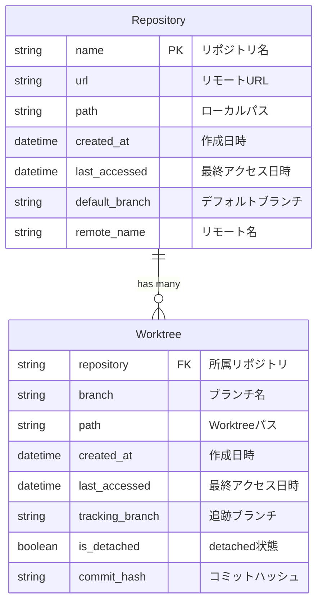
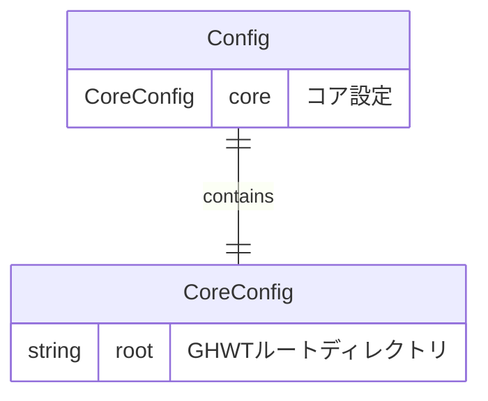
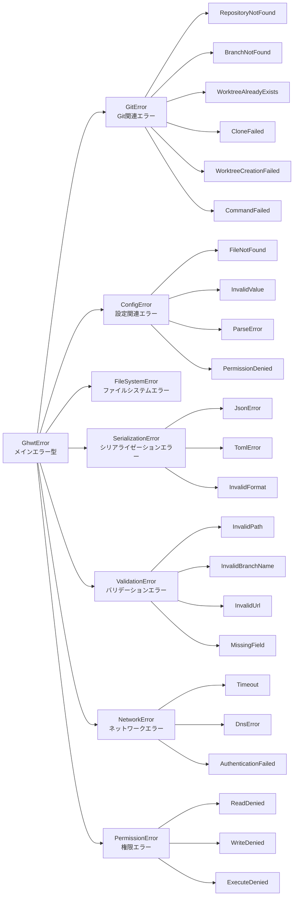
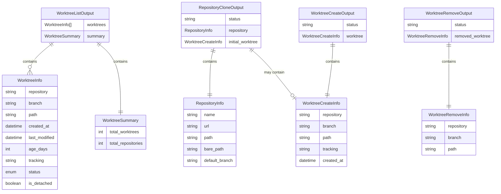

# GHWT データ構造概念仕様書

**Version**: 1.0  
**Date**: 2025-06-01  
**Status**: Draft  

## 概要

本ドキュメントは GHWT プロジェクトのデータ構造の概念設計と、JSON出力形式の仕様を定義する。
実装言語に依存しない概念レベルでの構造定義により、将来的な多言語実装や仕様変更に対応可能な設計を提供する。

## 目的

- データ構造の概念設計と関係性を定義
- JSON出力形式をJSON Schemaで厳密に仕様化
- 実装言語に依存しない抽象的なデータモデルを確立
- CLI仕様書との整合性を保証

---

## 1. 概念データ構造

### 1.1 基本エンティティ

GHWT の核となるデータエンティティとその関係性を定義する。

#### 基本エンティティ一覧

| エンティティ名 | 目的 |
|---------------|------|
| `Repository` | リポジトリ情報の管理 |
| `Worktree` | Worktree情報の管理 |

#### エンティティ関係図



### 1.2 設定データ構造

アプリケーション設定の階層構造を定義する。

#### 設定構造体一覧

| 構造体名 | 目的 |
|----------|------|
| `Config` | アプリケーション設定の統合管理 |
| `CoreConfig` | コア機能設定 |

#### 設定構造関係図



### 1.3 エラー型階層

統一的なエラーハンドリングのための型階層を定義する。

#### エラー型一覧

| エラー型 | 分類 |
|----------|------|
| `GhwtError` | 統合エラー型 |
| `GitError` | Git関連エラー |
| `ConfigError` | 設定関連エラー |
| `ValidationError` | バリデーションエラー |
| `SerializationError` | シリアライゼーションエラー |
| `NetworkError` | ネットワークエラー |
| `PermissionError` | 権限エラー |

#### エラー型階層図



---

## 2. JSON出力仕様

### 2.1 JSON出力構造の概要

各CLIコマンドのJSON出力構造とその関係性を定義する。

#### JSON出力構造体一覧

| 構造体名 | 対応コマンド |
|----------|-------------|
| `WorktreeListOutput` | `ghwt ls --json` |
| `RepositoryCloneOutput` | `ghwt get --json` |
| `WorktreeCreateOutput` | `ghwt new --json` |
| `WorktreeRemoveOutput` | `ghwt rm --json` |
| `WorktreeInfo` | 一覧表示用Worktree情報 |
| `WorktreeCreateInfo` | 作成時Worktree情報 |
| `WorktreeRemoveInfo` | 削除時Worktree情報 |
| `RepositoryInfo` | 共通リポジトリ情報 |

#### JSON出力構造関係図



### 2.2 JSON Schema 定義

#### 2.2.1 `ghwt ls --json` 出力

```json
{
  "$schema": "http://json-schema.org/draft-07/schema#",
  "title": "Worktree List Output",
  "type": "object",
  "required": ["worktrees", "summary"],
  "properties": {
    "worktrees": {
      "type": "array",
      "items": {
        "$ref": "#/definitions/WorktreeInfo"
      }
    },
    "summary": {
      "$ref": "#/definitions/WorktreeSummary"
    }
  },
  "definitions": {
    "WorktreeInfo": {
      "type": "object",
      "required": ["repository", "branch", "path", "created_at", "last_modified", "age_days", "status"],
      "properties": {
        "repository": {
          "type": "string",
          "description": "リポジトリ名"
        },
        "branch": {
          "type": "string",
          "description": "ブランチ名"
        },
        "path": {
          "type": "string",
          "description": "Worktreeのパス"
        },
        "created_at": {
          "type": "string",
          "format": "date-time",
          "description": "作成日時（ISO 8601形式）"
        },
        "last_modified": {
          "type": "string",
          "format": "date-time",
          "description": "最終更新日時（ISO 8601形式）"
        },
        "age_days": {
          "type": "integer",
          "minimum": 0,
          "description": "作成からの経過日数"
        },
        "tracking": {
          "type": ["string", "null"],
          "description": "追跡するリモートブランチ"
        },
        "status": {
          "type": "string",
          "enum": ["clean", "dirty"],
          "description": "Worktreeの状態"
        },
        "is_detached": {
          "type": ["boolean", "null"],
          "description": "detached HEAD状態かどうか"
        }
      }
    },
    "WorktreeSummary": {
      "type": "object",
      "required": ["total_worktrees", "total_repositories"],
      "properties": {
        "total_worktrees": {
          "type": "integer",
          "minimum": 0,
          "description": "総Worktree数"
        },
        "total_repositories": {
          "type": "integer",
          "minimum": 0,
          "description": "総リポジトリ数"
        }
      }
    }
  }
}
```

#### 2.2.2 `ghwt get --json` 出力

```json
{
  "$schema": "http://json-schema.org/draft-07/schema#",
  "title": "Repository Clone Output",
  "type": "object",
  "required": ["status", "repository"],
  "properties": {
    "status": {
      "type": "string",
      "enum": ["success", "error"],
      "description": "操作の結果"
    },
    "repository": {
      "$ref": "#/definitions/RepositoryInfo"
    },
    "initial_worktree": {
      "anyOf": [
        {"$ref": "#/definitions/WorktreeCreateInfo"},
        {"type": "null"}
      ],
      "description": "初期Worktree情報（作成された場合）"
    }
  },
  "definitions": {
    "RepositoryInfo": {
      "type": "object",
      "required": ["name", "url", "path", "bare_path", "default_branch"],
      "properties": {
        "name": {
          "type": "string",
          "description": "リポジトリ名"
        },
        "url": {
          "type": "string",
          "description": "リモートリポジトリURL"
        },
        "path": {
          "type": "string",
          "description": "ローカルリポジトリパス"
        },
        "bare_path": {
          "type": "string",
          "description": "bare repositoryのパス"
        },
        "default_branch": {
          "type": "string",
          "description": "デフォルトブランチ名"
        }
      }
    },
    "WorktreeCreateInfo": {
      "type": "object",
      "required": ["repository", "branch", "path", "created_at"],
      "properties": {
        "repository": {
          "type": "string",
          "description": "リポジトリ名"
        },
        "branch": {
          "type": "string",
          "description": "ブランチ名"
        },
        "path": {
          "type": "string",
          "description": "Worktreeのパス"
        },
        "tracking": {
          "type": ["string", "null"],
          "description": "追跡するリモートブランチ"
        },
        "created_at": {
          "type": "string",
          "format": "date-time",
          "description": "作成日時（ISO 8601形式）"
        }
      }
    }
  }
}
```

#### 2.2.3 `ghwt new --json` 出力

```json
{
  "$schema": "http://json-schema.org/draft-07/schema#",
  "title": "Worktree Create Output",
  "type": "object",
  "required": ["status", "worktree"],
  "properties": {
    "status": {
      "type": "string",
      "enum": ["success", "error"],
      "description": "操作の結果"
    },
    "worktree": {
      "$ref": "#/definitions/WorktreeCreateInfo"
    }
  },
  "definitions": {
    "WorktreeCreateInfo": {
      "type": "object",
      "required": ["repository", "branch", "path", "created_at"],
      "properties": {
        "repository": {
          "type": "string",
          "description": "リポジトリ名"
        },
        "branch": {
          "type": "string",
          "description": "ブランチ名"
        },
        "path": {
          "type": "string",
          "description": "Worktreeのパス"
        },
        "tracking": {
          "type": ["string", "null"],
          "description": "追跡するリモートブランチ"
        },
        "created_at": {
          "type": "string",
          "format": "date-time",
          "description": "作成日時（ISO 8601形式）"
        }
      }
    }
  }
}
```

#### 2.2.4 `ghwt rm --json` 出力

```json
{
  "$schema": "http://json-schema.org/draft-07/schema#",
  "title": "Worktree Remove Output",
  "type": "object",
  "required": ["status", "removed_worktree"],
  "properties": {
    "status": {
      "type": "string",
      "enum": ["success", "error"],
      "description": "操作の結果"
    },
    "removed_worktree": {
      "$ref": "#/definitions/WorktreeRemoveInfo"
    }
  },
  "definitions": {
    "WorktreeRemoveInfo": {
      "type": "object",
      "required": ["repository", "branch", "path"],
      "properties": {
        "repository": {
          "type": "string",
          "description": "リポジトリ名"
        },
        "branch": {
          "type": "string",
          "description": "ブランチ名"
        },
        "path": {
          "type": "string",
          "description": "削除されたWorktreeのパス"
        }
      }
    }
  }
}
```

---

## 3. データ永続化戦略

### 3.1 設定ファイル

- **形式**: TOML
- **場所**: XDG Base Directory Specification準拠
- **詳細**: [TOML設定ファイル完全スキーマ仕様書](./config-schema.md)参照

### 3.2 キャッシュファイル

- **形式**: JSON
- **目的**: Worktree情報の高速アクセス
- **場所**: `~/.cache/ghwt/` または `$XDG_CACHE_HOME/ghwt/`

### 3.3 ファイルロック

- **目的**: 並行アクセス制御
- **方式**: ファイルベースロック（`.lock`ファイル）

---

## 4. バリデーション仕様

### 4.1 入力値検証

#### Repository
- `name`: 非空文字列、有効なディレクトリ名
- `url`: 有効なGit URL（https://またはgit@）
- `path`: 絶対パス

#### Worktree
- `branch`: 非空文字列、有効なGitブランチ名
- `path`: 絶対パス、書き込み可能

#### Config
- `core.root`: 非空文字列、展開可能なパス

### 4.2 整合性チェック

- **リポジトリ-Worktree関係**: 全WorktreeのリポジトリがRepository一覧に存在
- **ファイルシステム整合性**: Worktreeパスが実際に存在
- **Git整合性**: Worktreeが有効なGit worktreeとして認識される

---

## 5. 完了条件チェックリスト

- [x] `docs/003-specifications/data-structures.md` ファイルが作成されている
- [x] 概念レベルのデータ構造が定義されている
- [x] JSON出力形式がJSON Schemaで厳密に定義されている
- [x] CLI仕様書との整合性が保たれている
- [x] 実装言語に依存しない抽象的な設計になっている
- [x] エラー型階層が明確に定義されている
- [x] データ永続化戦略が明記されている
- [x] バリデーション仕様が含まれている

---

## 6. 関連ドキュメント

- [CLI インターフェース完全仕様書](./cli-interface.md)
- [TOML設定ファイル完全スキーマ仕様書](./config-schema.md)
- [エラーハンドリング完全仕様書](./error-handling.md)
- [要件定義書](../002-requirements/requirements-ja.md)
- [ADR-004: Rust実装の選択](../001-adr/004-rust-implementation.md)

---

*本仕様書は GHWT プロジェクトのデータ構造基盤として、実装言語に依存しない概念設計を提供します。*