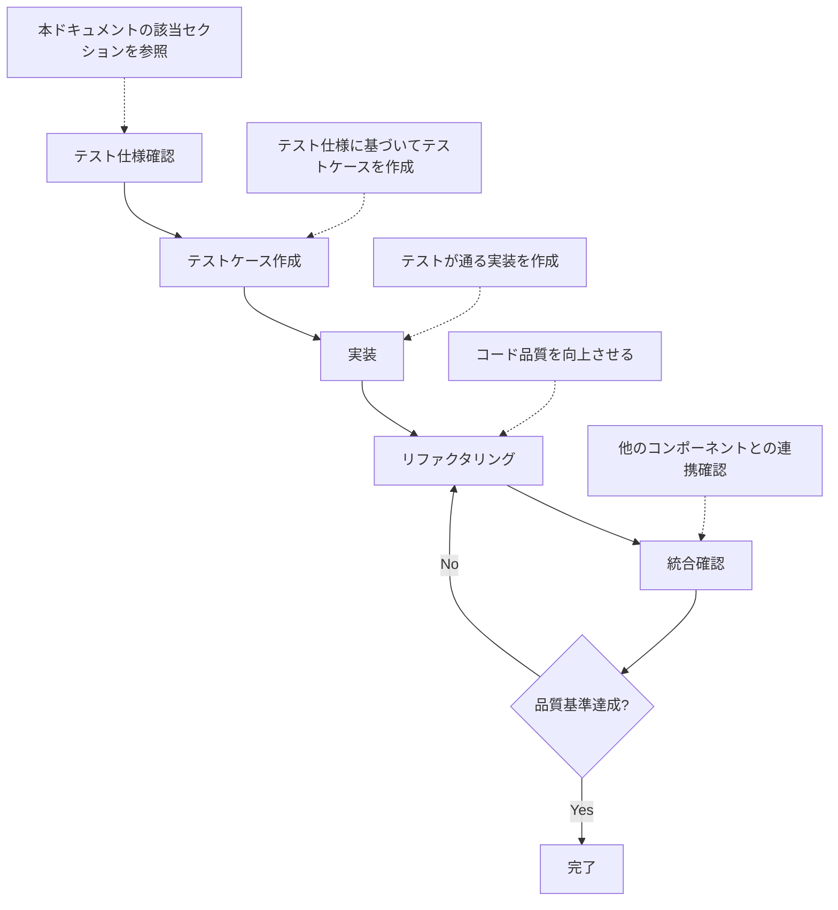
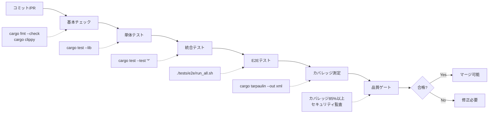
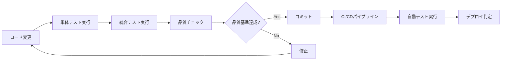
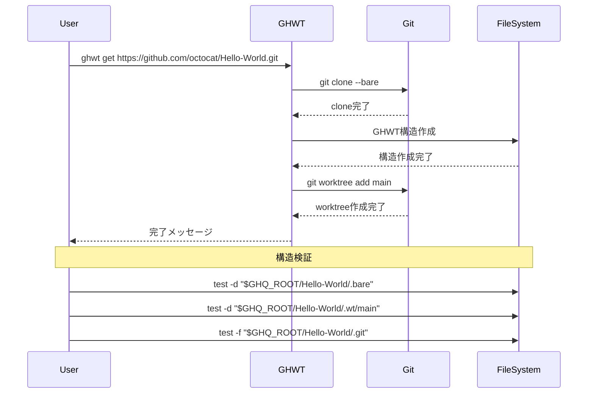
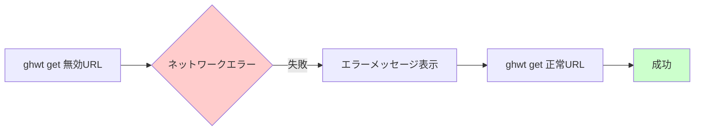
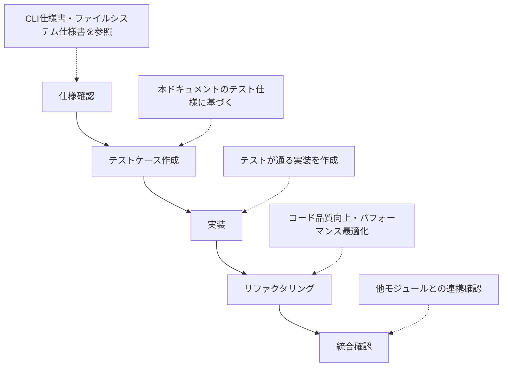

# GHWT テスト戦略ドキュメント

**Date**: 2025-06-01  
Version 1.0 — 2025-06-01

## 概要

本ドキュメントは GHWT (Git Worktree Tool) のテスト戦略を定義し、AI駆動開発における品質保証の基盤を提供する。
TDD (Test-Driven Development) アプローチを採用し、テスト仕様を先行定義することで、AIが実装すべき要件を明確化し、高品質なソフトウェアの実現を目指す。

## 関連ドキュメント

- [../003-designs/cli-interface.md](../003-designs/cli-interface.md) - CLI インターフェース仕様
- [../003-designs/filesystem-layout.md](../003-designs/filesystem-layout.md) - ファイルシステムレイアウト仕様
- [../002-requirements/requirements-ja.md](../002-requirements/requirements-ja.md) - 基本要件
- [implementation-guidelines.md](implementation-guidelines.md) - 実装ガイドライン

## 変更履歴

| 日付 | バージョン | 変更内容 |
|------|------------|----------|
| 2025-06-01 | 1.0 | 初版作成（AI駆動開発対応） |

---

## 1. AI駆動開発におけるテスト戦略

### 1.1 基本方針

**AI駆動開発の特徴:**
- **テスト先行設計**: 実装前にテスト仕様を完全定義
- **機械可読な仕様**: AIが理解しやすい明確なテストケース
- **自動化優先**: 人間の介入を最小限に抑えた自動テスト
- **継続的品質保証**: CI/CDパイプラインでの自動実行

### 1.2 TDD開発サイクル



---

## 2. テスト分類と要件

### 2.1 テスト分類

| テスト分類 | 責務範囲 | 実行頻度 | 自動化レベル | カバレッジ目標 |
|-----------|----------|----------|-------------|---------------|
| **単体テスト** | 関数・モジュール単位 | 毎コミット | 100% | 90%以上 |
| **統合テスト** | コンポーネント間連携 | 毎プッシュ | 100% | 80%以上 |
| **E2Eテスト** | ユーザーシナリオ全体 | 毎PR | 100% | 70%以上 |
| **パフォーマンステスト** | 応答時間・メモリ使用量 | 毎リリース | 90% | - |

## 2.2 テストファイルの配置ポリシー

GHWTプロジェクトにおけるテストファイルの配置は、以下のポリシーに厳密に従う**こと**。

*   **単体テスト (Unit Tests)**:
    *   テスト対象の関数やモジュールと同じソースコードファイル（`src` ディレクトリ内の `.rs` ファイル）内に、`#[cfg(test)]` アトリビュートを付与したテストモジュール（例: `mod tests { ... }`）として定義する**こと**。
    *   これにより、プライベートな関数やインターフェースに対してもテストが可能となります。

*   **統合テスト (Integration Tests) および E2Eテスト (End-to-End Tests)**:
    *   プロジェクトのルートディレクトリ直下にある `tests` ディレクトリ内に配置する**こと**。
    *   `tests` ディレクトリ内の各 `.rs` ファイルは、それぞれ独立したテストクレートとしてコンパイルされます。
    *   これらのテストは、クレートの公開APIをテストする、またはコマンドラインインターフェース全体の動作を外部から検証するために使用します。
    *   ファイル名は、テスト対象の機能が明確になるように命名する**こと** (例: `tests/cli_config_get.rs`, `tests/worktree_creation.rs`)。

### 2.3 テスト対象モジュール

#### 2.3.1 CLI パーサーモジュール
**必須テストケース:**
- 正常系: 有効なGit URLの解析
- 異常系: 無効なURLの拒否
- 正常系: 有効なブランチ名の処理
- 異常系: 無効なブランチ名の正規化
- グローバルオプションの解析

#### 2.3.2 ファイルシステム操作モジュール
**必須テストケース:**
- 正常系: GHWT構造の作成と検証
- 異常系: 既存ディレクトリでの作成エラー
- GHWT管理下リポジトリの検証
- ブランチ名正規化の各パターン
- アトミックな操作の保証

#### 2.3.3 Git操作モジュール
**必須テストケース:**
- 正常系: bare cloneの実行と検証
- 正常系: worktreeの作成と検証
- 異常系: 存在しないブランチでのエラー
- Git コマンド実行の基本動作
- ネットワークエラー・権限エラーの適切な処理

### 2.4 エラーハンドリング要件

**必須エラーケース:**
- ネットワークエラー（接続失敗、タイムアウト）
- 権限エラー（読み取り専用、アクセス拒否）
- ディスク容量不足エラー
- Git操作エラー（不正なリポジトリ状態）
- 並行アクセス時の競合状態

---

## 3. テスト環境・ツール

### 3.1 必須ライブラリ

```toml
[dev-dependencies]
# 基本テストフレームワーク
tempfile = "3.8"          # テスト環境分離
assert_cmd = "2.0"        # CLI統合テスト
predicates = "3.0"        # アサーション

# モック・スタブ
mockall = "0.11"          # モック作成

# パフォーマンステスト
criterion = "0.5"         # ベンチマーク

# カバレッジ測定
tarpaulin = "0.27"        # カバレッジ測定
```

### 3.2 テスト環境分離

**環境分離戦略:**
- `tempfile::TempDir`による分離されたテスト環境
- 環境変数の適切な設定・リセット
- 並行テスト実行時の安全性保証
- グローバル状態変更時の排他制御

### 3.3 モック戦略

**ファイルシステムモック:**
- ディレクトリ作成・削除・存在確認
- ファイル読み書き操作
- 権限エラーのシミュレーション

**Git操作モック:**
- clone、worktree作成操作
- ブランチ一覧取得
- エラー状態のシミュレーション

---

## 4. CI/CD・品質保証

### 4.1 テスト実行フロー



### 4.2 品質ゲート条件

- **コードフォーマット**: `cargo fmt --check`
- **静的解析**: `cargo clippy -- -D warnings`
- **テストカバレッジ**: 85%以上
- **セキュリティ監査**: `cargo audit`
- **全テスト通過**: 単体・統合・E2E

### 4.3 パフォーマンス基準

| メトリクス | 目標値 | 測定方法 | 頻度 |
|-----------|--------|----------|------|
| **テスト実行時間** | 5分以内 | CI測定 | 毎コミット |
| **メモリ使用量** | 50MB以下 | プロファイリング | 毎リリース |
| **バイナリサイズ** | 10MB以下 | cargo size | 毎リリース |
| **起動時間** | 100ms以下 | ベンチマーク | 毎リリース |

### 4.4 継続的品質監視



---

## 5. E2Eテストシナリオ

### 5.1 基本ワークフロー

**シナリオ1: リポジトリ取得からworktree作成**



**シナリオ2: 複数worktreeの並行作業**
```bash
# 複数worktree作成
ghwt new hotfix-urgent
ghwt new review-pr-123

# 独立した作業の確認
cd .wt/feature-test && echo "feature work" > feature.txt
cd ../hotfix-urgent && echo "hotfix work" > hotfix.txt

# 互いに影響しないことを確認
test ! -f ../feature-test/hotfix.txt
test ! -f ../hotfix-urgent/feature.txt
```

### 5.2 エラー回復シナリオ

**ネットワークエラーからの回復:**



**既存ディレクトリエラーからの回復:**
```bash
# 既存ディレクトリでの失敗確認
if ghwt get https://github.com/octocat/Hello-World.git; then
    exit 1  # 失敗すべき
fi

# --forceオプションで上書き成功
ghwt get --force https://github.com/octocat/Hello-World.git
```

---

## 6. テスト活動タイムライン

### 6.1 AI駆動開発フェーズ

```mermaid
gantt
    title AI駆動開発におけるテスト活動タイムライン
    dateFormat X
    axisFormat %s

    section 要件定義フェーズ
    要件分析・整理           :req1, 0, 1
    テスト戦略策定           :test-strategy, after req1, 1
    テスト分析・設計         :test-analysis, after test-strategy, 2

    section 実装準備フェーズ  
    テスト仕様書作成         :test-spec, after test-analysis, 2
    テスト環境準備           :test-env, after test-spec, 1

    section AI実装フェーズ
    テストケース実装         :test-impl, after test-env, 2
    機能実装                 :feature-impl, after test-impl, 3
    テスト実行・修正         :test-exec, after feature-impl, 2

    section 品質保証フェーズ
    統合テスト               :integration, after test-exec, 1
    E2Eテスト               :e2e, after integration, 1
    パフォーマンステスト      :perf, after e2e, 1
```



### 6.2 実践的なスケジュール

**GHWTプロジェクトの場合:**

| フェーズ | 期間 | 主要活動 | 成果物 |
|---------|------|----------|--------|
| **Week 1** | 要件定義 | テスト戦略策定、テスト分析 | 本ドキュメント、実装ガイドライン |
| **Week 2** | 実装準備 | テスト仕様作成、環境準備 | 機能別テスト仕様、CI/CD設定 |
| **Week 3-4** | AI実装 | テスト実装、機能実装 | テストコード、機能コード |
| **Week 5** | 品質保証 | 統合・E2Eテスト | テスト結果、品質レポート |

**重要なマイルストーン:**
- ✅ テスト戦略承認（Week 1終了時）
- ✅ テスト仕様完成（Week 2終了時）
- ✅ 機能実装完了（Week 4終了時）
- ✅ 品質基準達成（Week 5終了時）

---

## 7. AI開発者向け実践ガイド

### 7.1 開発フロー



### 7.2 テスト実行コマンド

```bash
# 開発中の基本テスト
cargo test --lib

# 統合テスト実行
cargo test --test '*'

# カバレッジ確認
cargo tarpaulin --out html

# パフォーマンス測定
cargo bench

# 完全なテストスイート
./tests/e2e/run_all.sh
```

### 7.3 AI実装時の注意点

**テスト仕様の完全性確保:**
- AIが理解しやすい明確なテスト仕様
- 期待値の具体的な定義
- エラーケースの網羅的な列挙
- 境界値・例外ケースの明示

**品質管理:**
- テスト実行結果の自動監視
- コード品質メトリクスの追跡
- AI生成コードの品質評価
- 人間によるコードレビュー

### 7.4 トラブルシューティング

**よくある問題と解決策:**

| 問題 | 原因 | 解決策 |
|------|------|--------|
| **テスト環境の競合** | 並行実行での共有リソース | tempfile::TempDirの使用 |
| **Git操作の失敗** | 不正な状態のリポジトリ | テスト用リポジトリの初期化 |
| **ネットワークタイムアウト** | 外部リポジトリへの依存 | モックまたはローカルリポジトリ使用 |

**デバッグ支援:**
- テスト環境の状態確認（ディレクトリ構造・環境変数）
- 分離されたテスト環境の使用
- モックを使用した外部依存の排除
- 段階的なテスト実行による問題箇所の特定

---

## 8. まとめ

本テスト戦略ドキュメントは、AI駆動開発における品質保証の基盤を提供する。TDDアプローチにより、実装前にテスト仕様を明確化し、AIが高品質なコードを生成できる環境を整備した。

**重要なポイント:**
- **テスト先行**: 実装前にテスト仕様を完全定義
- **自動化優先**: 人間の介入を最小限に抑制
- **品質保証**: 継続的な品質監視と改善
- **AI協調**: AIが理解しやすい明確な仕様

このドキュメントに基づいてテストを実装し、実行することで、堅牢で信頼性の高いGHWTツールの開発が可能となる。 